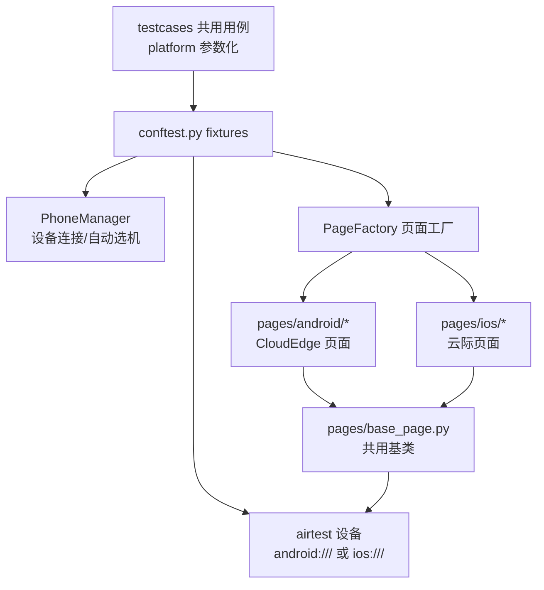

# PO_PythonProject — 移动 App 双端 UI 自动化测试框架

基于 **poco + pytest + allure** 的移动 App UI 自动化测试框架，采用 **PO（Page Object）设计模式**，支持 **Android 与 iOS 双端**用例共用、按平台参数化运行。

同一产品的双端版本共用一套业务用例：

| 平台 | App | 包名 / Bundle ID |
|---|---|---|
| Android | CloudEdge | `com.cloudedge.smarteye` |
| iOS | 云际 | `com.meari.smartcamera` |

## 技术栈

- **语言**：Python 3（遵循 PEP-8，行宽 100，已通过 pycodestyle 检查）
- **UI 驱动**：poco（pocoui）+ airtest 设备连接
- **测试框架**：pytest（fixture 体系 + 参数化）
- **测试报告**：allure-pytest（步骤、失败截图、平台分组标签）
- **设备管理**：adb（Android）/ Xcode devicectl（iOS），多设备多平台统一管理
- **设计模式**：PO 模式 + 页面工厂 + 抽象连接器（OOP 优先）

## 目录结构

```text
PO_PythonProject/
├── pages/                        # PO 页面对象层
│   ├── base_page.py              # [共用] 基类：元素操作 + app 生命周期
│   ├── page_factory.py           # [共用] 页面工厂：按 (平台, 页面名) 分发页面类
│   ├── android/                  # Android 平台页面包（CloudEdge）
│   │   └── main_page.py          #   主页面：定位器 + 业务方法
│   └── ios/                      # iOS 平台页面包（云际）
│       └── main_page.py          #   主页面：与安卓端同名接口
├── testcases/                    # 测试用例层
│   ├── conftest.py               # 核心 fixtures：--platform 选项、设备连接、
│   │                             #   poco 驱动、app 生命周期、失败截图钩子
│   ├── test_app_lifecycle.py     # 双端共用用例（按 platform 参数化）
│   ├── android/                  # 安卓端特有用例（权限弹窗、系统键等）
│   └── ios/                      # iOS 端特有用例
├── utils/                        # 公共工具层
│   ├── log_utils.py              # 日志（控制台 + 按大小轮转文件）
│   ├── serial_utils.py           # 串口工具（循环读取/写入/关键字检测）
│   └── phone_manager.py          # 手机管理（adb/devicectl 多态连接器 + 配置比对）
├── config/
│   ├── config.yaml               # 设备与 app 配置（devices 列表）
│   └── config_manager.py         # 配置校验
├── test_datas/                   # 测试数据
├── reports/                      # 失败截图 + allure html 报告输出
├── operater_logs/                # 运行日志
├── serial_logs/                  # 串口日志
├── run.py                        # 运行入口（pytest 命令组装 + allure 报告）
├── pytest.ini                    # pytest 配置（markers、allure 输出）
├── requirements.txt              # Python 依赖
└── README.md                     # 本文档
```

## 环境准备

### 1. Python 依赖

```bash
pip install -r requirements.txt
```

依赖清单：`PyYAML`、`pocoui`、`airtest`、`pytest`、`allure-pytest`

### 2. 系统工具

| 工具 | 用途 | 安装方式 |
|---|---|---|
| adb | Android 设备连接 | 安装 Android platform-tools |
| Xcode 命令行工具 | iOS 设备连接（`xcrun devicectl`） | `xcode-select --install` |
| allure 命令行 | 生成 html 报告 | `brew install allure` |

### 3. 设备连接

- **Android**：USB 连接并开启「开发者选项 → USB 调试」，确认 `adb devices` 状态为 `device`
- **iOS**：USB 连接并在手机上信任此电脑，确认已配对（`xcrun devicectl list devices` 显示 `available (paired)`）

## 配置说明

设备与 app 信息统一在 `config/config.yaml` 中维护：

```yaml
devices:
  - user_name: "肥猪阿熊"                 # 用户名（connect 按此查找设备）
    phone_model: "Redmi Note 11 5G"      # 机型（仅备注）
    platform: Android                     # 平台：Android / iOS
    udid: "TC55LJMR59W8ZPRK"             # 设备 UDID（安卓真机序列号 / iOS UDID）
    app_package: "com.cloudedge.smarteye"  # 被测 app 包名或 Bundle ID

  - user_name: "阿熊"
    platform: iOS
    udid: "00008110-000130AA1A05401E"
    app_package: "com.meari.smartcamera"
    wda_port: 8100                        # iOS 专用：WebDriverAgent 端口（默认 8100）
```

| 字段 | 必填 | 说明 |
|---|---|---|
| `user_name` | 是 | 设备别名，`PhoneManager.connect()` 按此连接 |
| `platform` | 是 | `Android` / `iOS`（忽略大小写） |
| `udid` | 是 | 安卓真机为序列号，模拟器为 `127.0.0.1:端口`，iOS 为 UDID |
| `app_package` | 是 | 安卓包名 / iOS Bundle ID |
| `wda_port` | iOS 多设备必填 | WDA 端口，多台 iOS 需手动分配不同端口 |

## 快速开始

### 方式一：run.py 入口（推荐）

```bash
python run.py                          # 双端全跑
python run.py --platform android       # 仅安卓端（CloudEdge）
python run.py --platform ios           # 仅 iOS 端（云际）
python run.py --platform android --report   # 运行后生成 allure 报告
python run.py --pytest-args "-k smoke"      # 透传任意 pytest 参数
python run.py --pytest-args "--collect-only -q"  # 仅收集用例
```

### 方式二：pytest 直接调用

```bash
pytest                                  # 双端全跑
pytest --platform android               # 指定平台
pytest testcases/test_app_lifecycle.py  # 指定文件
pytest -k "restart"                     # 按关键字筛选
```

`--platform` 选项会自动参数化声明了 `platform` fixture 的共用用例：
`--platform all` 生成 `test_xxx[android]` 与 `test_xxx[ios]` 两组用例。

### 查看 allure 报告

```bash
allure generate allure-results -o reports/allure-report --clean
allure open reports/allure-report
```

或运行后直接 `allure serve allure-results`。用例按平台自动打标签
（`安卓端 · app 生命周期` / `iOS 端 · app 生命周期`），失败用例自动附加设备截图。

## 架构说明

### 分层设计：公共层共用、平台层分包



### fixture 依赖链

| fixture | 作用域 | 职责 |
|---|---|---|
| `phone_manager` | session | 设备管理器，结束时统一断开 |
| `device_info` | session | 按平台自动连接第一台在线设备 |
| `airtest_device` | session | 建立 airtest 设备连接（iOS 前先探测 WDA） |
| `poco_driver` | function | 创建 poco 驱动（每用例重建，保证隔离） |
| `app_page` | function | 启动 app → 注入平台页面实例 → 用例结束关闭 app |

### 双端差异处理

| 差异点 | 处理方式 |
|---|---|
| 设备连接 | `AndroidAdbConnector`（adb）/ `IosXcodeConnector`（devicectl）多态分发 |
| app 启动/关闭 | `BasePage.start_app/stop_app/restart_app` 内部按平台选命令 |
| 页面定位器 | 双端页面类各自维护，业务方法同名同义 |
| 用例 | 共用用例按 `platform` 参数化一次编写双端运行 |

## 扩展指南

### 新增一个页面（3 步）

1. 在 `pages/android/` 与 `pages/ios/` 各实现一个页面类（继承 `BasePage`，
   定义定位器类属性 + 业务方法，**双端业务方法保持同名**）：

```python
# pages/android/login_page.py
from pages.base_page import BasePage

class CloudEdgeLoginPage(BasePage):
    INPUT_USER = {"text": "用户名"}
    BTN_LOGIN = {"text": "登录"}

    def login(self, user: str, pwd: str):
        self.input_text(self.INPUT_USER, user)
        self.click(self.BTN_LOGIN)
```

2. 在 `pages/android/__init__.py` / `pages/ios/__init__.py` 导出页面类；

3. 在 `pages/page_factory.py` 的 `REGISTRY` 中注册：

```python
REGISTRY = {
    ("android", "main_page"): CloudEdgeMainPage,
    ("android", "login_page"): CloudEdgeLoginPage,   # 新增
    ...
}
```

用例中通过工厂获取当前平台页面（`app_page` fixture 可扩展支持页面名参数）：

```python
page = PageFactory.create(platform, "login_page", poco=poco, udid=udid)
```

### 新增共用用例

```python
@allure.epic("登录")
@allure.story("账号密码登录")
def test_login(app_page, platform):
    """声明 platform fixture 即自动双端参数化。"""
    with allure.step("输入账号并登录"):
        app_page.login("user", "pwd")
```

平台特有用例放入 `testcases/android/` 或 `testcases/ios/` 目录。

## 注意事项与 FAQ

**Q: iOS 用例被跳过，提示「WebDriverAgent 未就绪」？**

iOS 端 poco 依赖 WDA。请先在 iOS 设备上启动 WebDriverAgent（端口与
`config.yaml` 中 `wda_port` 一致），确认 `http://127.0.0.1:8100/status`
可访问后再运行。WDA 未就绪时 iOS 用例会带原因跳过，**不影响安卓端**。

**Q: 用例报「平台无任何在线设备」？**

检查设备连接（`adb devices` / `xcrun devicectl list devices`），并核对
`config.yaml` 中的 `udid` 是否与实际设备一致。可用模块自测比对配置：

```bash
python -m utils.phone_manager
```

**Q: 页面元素找不到？**

仓库中的页面定位器为**示例值**，首次编写业务用例前请按 CloudEdge / 云际
实际 UI 结构调整 `pages/android/`、`pages/ios/` 中的定位器。定位优先级：
基本选择器（`name`/`text`/`type`）> 相对选择器 > 索引 > 正则。

**Q: 日志与截图在哪？**

- 运行日志：`operater_logs/`（按天命名，超 10MB 自动轮转）
- 失败截图：`reports/failure_*.png`（同时附加到 allure 报告）
- allure 结果：`allure-results/`；html 报告：`reports/allure-report/`
