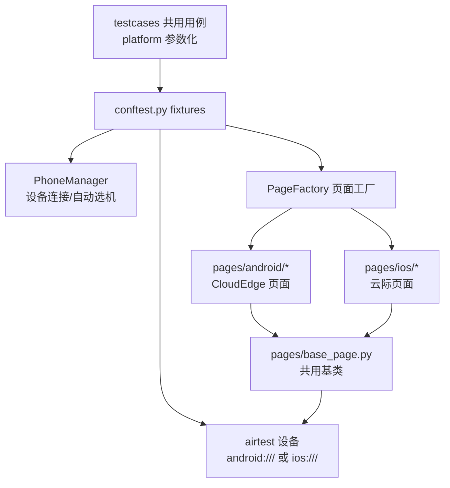

# 架构说明

## 分层设计：公共层共用、平台层分包

## fixture 依赖链

| fixture | 作用域 | 职责 |
|---|---|---|
| `phone_manager` | session | 设备管理器，结束时统一断开 |
| `device_info` | session | 按平台自动连接第一台在线设备 |
| `airtest_device` | session | 建立 airtest 设备连接（iOS 前先探测 WDA） |
| `poco_driver` | function | 创建 poco 驱动（每用例重建，保证隔离） |
| `app_page` | function | 启动 app → 注入平台页面实例 → 用例结束关闭 app |

## 双端差异处理

| 差异点 | 处理方式 |
|---|---|
| 设备连接 | `AndroidAdbConnector`（adb）/ `IosXcodeConnector`（devicectl）多态分发 |
| app 启动/关闭 | `BasePage.start_app/stop_app/restart_app` 内部按平台选命令 |
| 页面定位器 | 双端页面类各自维护，业务方法同名同义 |
| 用例 | 共用用例按 `platform` 参数化一次编写双端运行 |

---

## 文档导航

- 上一篇：[快速开始 ←](../getting-started/quickstart.md)
- 下一篇：[扩展指南 →](../guide/extension.md)

[返回文档中心](../README.md) · [返回项目首页](../../README.md)
